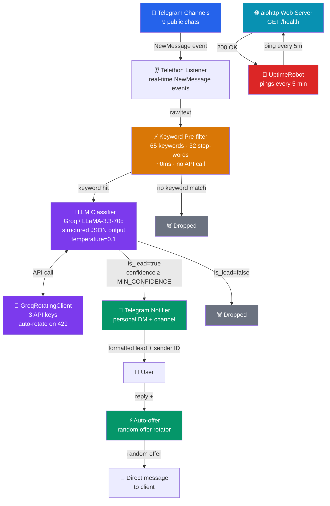

# 🤖 TG Lead Parser — AI-powered Telegram Lead Generation

> Автономный парсер лидов для фрилансеров. Мониторит Telegram-чаты 24/7, фильтрует целевые заявки через LLM и доставляет готовые структурированные лиды прямо в Telegram.


---

## 🎯 Задача

Фрилансер тратит часы ежедневно на ручной мониторинг десятков Telegram-чатов в поисках заказов. Большинство заявок теряется — другой исполнитель отвечает быстрее.

**Решение:** двухуровневый AI-пайплайн, который слушает чаты в реальном времени, классифицирует сообщения через LLM и доставляет только квалифицированные лиды с извлечёнными деталями. При получении лида достаточно ответить `+` — парсер автоматически отправит оффер заказчику.

---

## 🏗 Архитектура

```
Telegram Chats (9+ каналов)
        │
        ▼
┌─────────────────────────┐
│    Telethon Listener    │  ← real-time NewMessage events
└───────────┬─────────────┘
            │ все сообщения
            ▼
┌─────────────────────────┐
│    Keyword Pre-filter   │  ← 65 ключевых + 32 стоп-слова
│    (без API, ~0ms)      │    быстрое отсечение до LLM
└───────────┬─────────────┘
            │ только потенциальные лиды
            ▼
┌─────────────────────────┐
│    LLM Classifier       │  ← Groq / LLaMA-3.3-70b-versatile
│    GroqRotatingClient   │    structured output → JSON
│    (авторотация ключей) │    temperature=0.1
└───────────┬─────────────┘
            │ is_lead=true AND confidence ≥ MIN_CONFIDENCE
            ▼
┌─────────────────────────┐
│    Telegram Notifier    │  → личка + канал
│                         │
│    Ответ "+"            │  ← ротатор офферов (3 варианта)
│         ↓               │
│    Автооффер заказчику  │  → случайный оффер в личку
└─────────────────────────┘

+ aiohttp health-check → UptimeRobot keep-alive → 24/7 бесплатно
```

## 🗺 System Diagram



**Ключевое архитектурное решение — двухуровневая фильтрация.** Keyword-фильтр работает локально без API-запросов. Это снижает количество LLM-вызовов и уменьшает задержку для нерелевантных сообщений до нуля.

---

## 🧠 Prompt Engineering

Центральная задача — контекстная классификация. Одно и то же слово "карточки" означает заказ на дизайн, банковскую карту или карту памяти. "Текст" — коммерческий копирайтинг или обычное сообщение. LLM решает по контексту.

### System Prompt

```python
SYSTEM_PROMPT = """Ты — классификатор лидов для фрилансера с тремя специализациями:
1. Инфографика и карточки товаров для маркетплейсов (Wildberries, Ozon, Яндекс.Маркет)
2. Копирайтинг — тексты для карточек товаров, сайтов, соцсетей, лендингов
3. Дизайн — баннеры, рич-контент, визуал для маркетплейсов

Верни ответ СТРОГО в JSON формате:
{
    "is_lead": true или false,
    "confidence": число от 0.0 до 1.0,
    "service_type": "карточки_товаров" | "инфографика" | "копирайтинг" |
                    "тексты_маркетплейс" | "контент_соцсети" | "баннер" | null,
    "marketplace": "Wildberries" | "Ozon" | "Яндекс.Маркет" | "не маркетплейс" | null,
    "budget": "строка или null",
    "deadline": "строка или null",
    "contact": "@username или null",
    "product_type": "тип товара или тематика или null",
    "summary": "1-2 предложения: суть заказа",
    "reason": "почему это лид или почему нет"
}
...
"""
```

### Решения в промпте

**Поле `reason`** заставляет модель явно обосновывать классификацию перед вынесением вердикта. Наблюдалось снижение количества ложноположительных срабатываний по сравнению с прямым `is_lead: true/false`.

**Явные negative examples** — без перечисления что НЕ является лидом модель путает конкурентов ("делаю карточки") с заказчиками ("нужны карточки"). Критично для ниши фриланса.

**`temperature: 0.1` + `json_object` mode** — детерминированный structured output. При высокой температуре JSON ломается на нестандартных сообщениях.

**Настраиваемый порог `MIN_CONFIDENCE`** — через env var без передеплоя:
- `0.8+` — только очевидные заказы с деталями
- `0.65` — баланс точности и охвата
- `0.5` — максимальный охват, используется при тюнинге

### Пример вывода

```json
{
  "is_lead": true,
  "confidence": 0.93,
  "service_type": "тексты_маркетплейс",
  "marketplace": "Wildberries",
  "budget": "договорная",
  "deadline": "до конца недели",
  "contact": "@seller_oleg",
  "product_type": "спортивное питание, 15 SKU",
  "summary": "Селлер ищет копирайтера для описаний 15 товаров на WB, срок — неделя",
  "reason": "Явный запрос исполнителя с маркетплейсом, количеством позиций и дедлайном"
}
```

---

## ⚡ Автооффер по плюсику

При получении лида в Telegram достаточно ответить `+` на уведомление — парсер сам отправит оффер заказчику. Чтобы избежать бана за спам, используется ротатор из нескольких вариантов:

```python
OFFERS = [
    "Привет! Увидел запрос, свободен и готов взяться. Напишите детали.",
    "Привет! Увидел ваш запрос — актуально ещё? Готов обсудить.",
    "Привет! Увидел ваш запрос, можете рассказать подробнее о задаче?",
]

def get_random_offer() -> str:
    return random.choice(OFFERS)
```

Каждый раз отправляется случайный вариант — снижает вероятность отправки одинаковых сообщений подряд.

---

## 🔄 Ротация API ключей (groq_rotator.py)

```python
class GroqRotatingClient:
    def chat(self, messages: list[dict], model: str = "llama-3.3-70b-versatile") -> str | None:
        attempts = 0
        while attempts <= len(self.clients):
            try:
                response = self._get_current_client().chat.completions.create(
                    model=model,
                    messages=messages,
                    response_format={"type": "json_object"},
                    temperature=0.1,
                )
                return response.choices[0].message.content

            except RateLimitError:
                if not self._rotate():
                    return None
                attempts += 1
        return None
```

При исчерпании всех ключей — уведомление в Telegram. Автосброс в 03:00 UTC.

---

## 🌐 Keep-alive на бесплатном Render

```python
async def health_check(self, request):
    uptime = datetime.now() - self.started_at
    hours, remainder = divmod(int(uptime.total_seconds()), 3600)
    return web.json_response({
        "status":      "running",
        "uptime":      f"{hours}h {remainder // 60}m",
        "leads_found": self.stats["leads_found"],
        "offers_sent": self.stats["offers_sent"],
        "checked":     self.stats["checked"],
    })
```

UptimeRobot пингует `/health` каждые 5 минут → Render не засыпает → **$0/месяц**.

---

## 📊 Наблюдаемые метрики (production)

Данные из ежедневной статистики после недели работы в боевом режиме:

| Метрика | Значение |
|---|---|
| Сообщений проверяется в день | ~1 100 — 1 300 |
| Проходит keyword-фильтр | 5 — 7 в день |
| Каналов в мониторинге | 9 |
| Стоимость инфраструктуры | $0/месяц |

> Evaluation на размеченном датасете с precision/recall в процессе — см. `eval.py`.

---

## ⚠️ Fail Cases — что пошло не так и как чинили

Этот раздел документирует реальные проблемы, возникшие в production.

### 1. Модель `llama3-8b-8192` была отключена Groq

**Симптом:** парсер запускался, keyword-фильтр срабатывал, но ни одного лида не приходило. В логах:
```
Error: model 'llama3-8b-8192' has been decommissioned
```

**Причина:** Groq без предупреждения вывел модель из эксплуатации. Код продолжал работать, ошибка глоталась как `None` от классификатора, лиды молча терялись.

**Решение:** переключились на `llama-3.3-70b-versatile`. Также добавили явное логирование ошибки модели отдельно от rate limit ошибок — чтобы такие случаи не терялись в логах.

**Вывод:** захардкоженное имя модели — риск. В roadmap: вынести модель в env var `GROQ_MODEL` для смены без передеплоя.

---

### 2. Каналы общего фриланса дают мало целевого трафика

**Симптом:** ~1 200 сообщений/день проверяется, но через keyword-фильтр проходит только 5-7. Лидов нет.

**Причина:** каналы общего фриланса (`@freelance_ru`, `@designer_jobs` и др.) содержат преимущественно вакансии в штат и предложения услуг, а не запросы заказчиков.

**Решение в процессе:** снижен порог `MIN_CONFIDENCE` с `0.65` до `0.5` для диагностики. Параллельно ведётся поиск каналов с более целевой аудиторией — сообщества селлеров маркетплейсов.

**Вывод:** качество каналов важнее количества. Один канал селлеров WB даст больше лидов чем десять общефриланс чатов.

---

### 3. `TelegramClient` в `__init__` ломался на Python 3.14

**Симптом:** при деплое на Render (Python 3.14) сервис падал сразу:
```
RuntimeError: There is no current event loop in thread 'MainThread'
```

**Причина:** `TelegramClient` создавался в `__init__` до запуска event loop. В Python 3.10+ это работало, в 3.14 — нет.

**Решение:** перенесли создание клиента внутрь `async def start()` где event loop уже активен.

---

### 4. Приватный invite-link канала не работает в Bot API

**Симптом:** при попытке отправить уведомление в канал по ссылке `https://t.me/+xxxxx` получали `400 Bad Request`.

**Причина:** Telegram Bot API принимает только числовой `chat_id` вида `-100xxxxxxxxxx`, но не invite-ссылки.

**Решение:** получили числовой ID через `@userinfobot` (пересылка сообщения из канала).

---

## 🔭 Future Improvements

- **`GROQ_MODEL` в env var** — смена модели без передеплоя, защита от внезапного decommission
- **Embedding search** вместо keyword pre-filter — семантический поиск поймёт "оформить позиции" без точного совпадения слов
- **Reranking** — второй LLM-проход для пограничных случаев (confidence 0.5–0.7)
- **Feedback loop** — кнопки "✅ Лид" / "❌ Мусор" в уведомлении для накопления размеченных данных
- **Active learning** — накопление размеченных данных для последующего fine-tuning или prompt optimization
- **Multi-niche YAML config** — один парсер для нескольких ниш без правки кода

---

## 🚀 Деплой

```env
TG_API_ID         # my.telegram.org
TG_API_HASH       # my.telegram.org
SESSION_STRING    # Telethon StringSession
BOT_TOKEN         # @BotFather
NOTIFY_TARGETS    # chat_id,@channel
GROQ_API_KEY_1    # console.groq.com
GROQ_API_KEY_2    # резервный
GROQ_API_KEY_3    # резервный
MIN_CONFIDENCE    # 0.65
```

```bash
pip install -r requirements.txt
python auth.py     # генерирует SESSION_STRING (один раз)
python eval.py     # прогоняет evaluation датасет
python parser.py   # запуск
```

---

## 📁 Структура

```
tg-lead-parser/
├── parser.py         # Telethon listener + автооффер + aiohttp keep-alive
├── classifier.py     # LLM классификатор + system prompt
├── groq_rotator.py   # Авторотация API ключей при rate limit
├── notifier.py       # Форматирование и доставка лидов
├── keywords.py       # 65 ключевых слов + 32 стоп-слова
├── eval.py           # Evaluation скрипт + размеченный датасет
├── channels.txt      # Мониторируемые каналы
├── auth.py           # Генерация Telethon StringSession
├── render.yaml       # Render deployment config
└── requirements.txt
```

---

## ⚙️ Стек

| | Технология | Зачем |
|---|---|---|
| Listener | Telethon 1.36 | User client — любые публичные чаты без прав админа |
| LLM | Groq / LLaMA-3.3-70b | Быстрый inference, бесплатный tier |
| Key rotation | Кастомный GroqRotatingClient | Обход дневных rate limit без остановки |
| Structured output | json_object + temperature 0.1 | Стабильный JSON из неструктурированного текста |
| Offer rotation | random.choice | Защита от детектирования спама Telegram |
| Web server | aiohttp | Health-check endpoint для Render keep-alive |
| Auth | Telethon StringSession | Авторизация через env var без файлов сессии |
| Notifications | Telegram Bot API + httpx | Личка + канал одновременно |
| Deploy | Render free + UptimeRobot | 24/7 без VPS и без оплаты |

---

*Проект — часть портфолио по AI/Prompt Engineering.*
